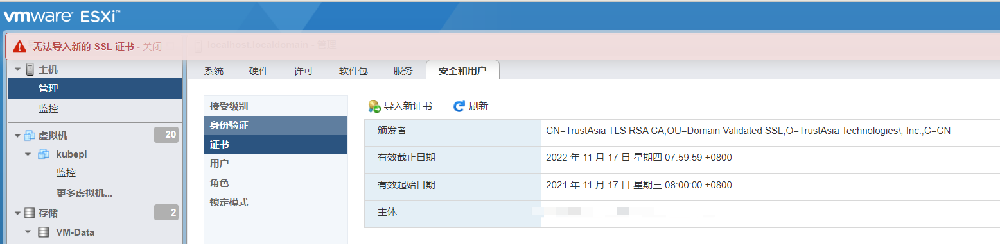
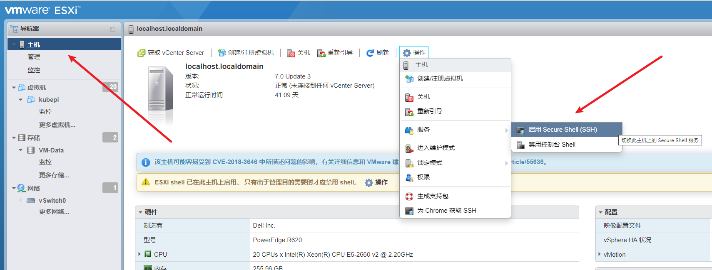
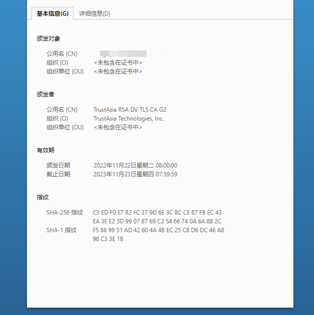

# ESXi 更换证书


ESXi 虚拟化环境的 HTTPS 证书到期，前端更换失败，通过 SSH 登录宿主，替换证书文件的方式更新 HTTPS 证书。


<!--more-->

## 前端更新失败

从前端导入证书失败，固使用 SSH 到宿主上替换证书文件。




## 通过 SSH 登录宿主更新

ssh 使用 root 用户登录后

进入 /etc/vmware/ssl 目录，rui.crt、rui.key，是默认的证书文件。

**开启 SSH 登录**




**备份原证书**

```bash
cp rui.crt rui.crt.bak
cp rui.key rui.key.bak
```

vi 编辑，%d 清空，复制申请好的证书 .pem 到 rui.crt， .key 到 rui.key

**重启服务**

```bash
/etc/init.d/hostd restart   # 重启 hostd 服务
/etc/init.d/vpxa restart    # 重启 vpxa 服务
/etc/init.d/vpxa start      # 启动 vpxa 服务
/etc/init.d/hostd start     # 启动 hostd 服务
```

## 完成

**登录检查证书**




**关闭 SSH**

为保证安全，关闭 SSH 登录。


