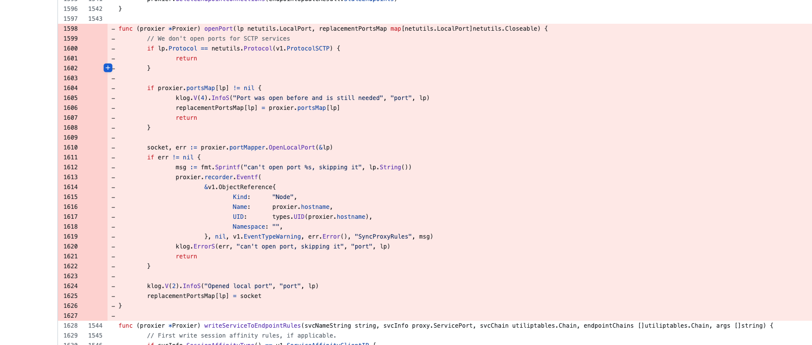
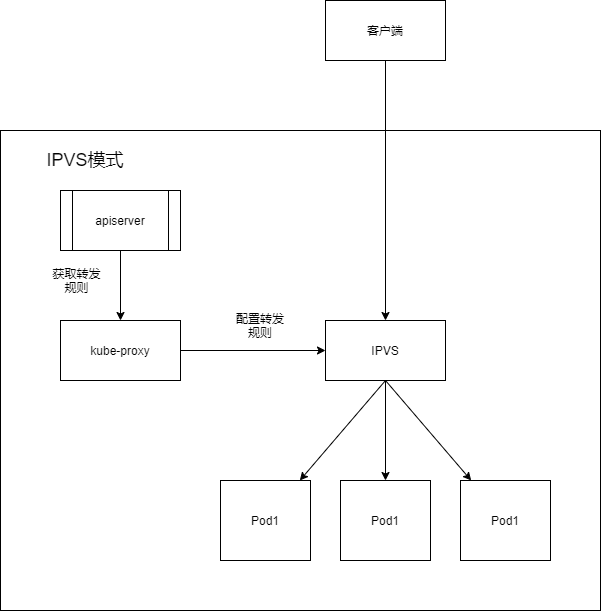

# k8s NodePort 端口监听问题

升级 K8s 集群版本后，发现 netstat 看不到 nodePort Service 监听的端口了，随时排查一番，发现是某个版本中取消了 kube-proxy 监听 nodePort 的功能。
<!--more-->

## 背景

根据原来学习的内容， nodePort 类型的 Service ，会在本机监听对应的端口，可以使用 netstat -antlp 查询端口监听的状态。
但升级集群版本后，用 ss 看不到监听的端口了，以为是哪里出了问题，
查了半天资料，终于搞清楚了，是 2022 年 3 月的某个 commit ，删除了 kube-proxy 监听 nodePort 的功能
所以之后发布的版本，用 netstat 就看不到 nodePort 端口了

## 为什么删除

根据 [PR](https://github.com/kubernetes/kubernetes/pull/108496) 中的描述

最早实现让 kube-proxy 监听 nodePort 端口，是想阻止用户在节点上监听 nodePort ，以免冲突，以及会带来调试问题。

但需要注意的是,即便 kube-proxy 监听端口失败,也只是记录日志并继续创建转发规则，实际并不影响流量。

然而,由 kube-proxy 打开端口，带来的问题比价值更大。

问题可以简要描述为以下几点:

1. 性能问题，因为要先由 proxy 开端口，再配置转发规则，如果规则过多还没配置好，那你实际连的就是 proxy 的端口，而不是转发到实际的业务端口（以内还没配置好呢呗），当集群的规模越来越大时，这个问题就更加明显了
2. 可能会有很多 CLOSE_WAIT 状态的 TCP 连接没有及时释放，会消耗主机的资源

## 删除后有什么影响

kube-proxy 将不再在节点上保持 Service NodePort 端口处于打开状态。所以用 netstat or ss 将看不到监听的 nodePort 端口，可以通过 ipvsadm -Ln 来查看转发规则。

但仍建议你不要在 kube-proxy 使用的节点端口范围内（默认30000-32768），监听任何端口。

因为 ipvs 在内核态就根据转发规则把流量转发给后端 Pod 了，你在 node 上再监听的端口实际收不到数据。

同时，如果你的应用使用了 HostNetwork，要小心不要使用 nodePort 范围的端口，比如默认的 30000-32767，不然如果 nodePort 随机分配到你的 HostNetwork 端口，流量就直接被 ipvs 转发了。

## 从哪个版本开始修改的

根据 commit 提交的时间（2022年3月），和我的测试，能确认是2022年5月份之后的版本，已全部删除 kube-proxy 监听 NodePort 的代码。

测试已删除代码的版本：

- 1.21.13 及之后小版本
- 1.22.10 及之后小版本
- 1.23.7 及之后小版本
- 1.24.1 及之后小版本
- 1.25.0 及之后小版本
- 以及后续所有新版本

## 参考

-  https://github.com/kubernetes/kubernetes/pull/108496
